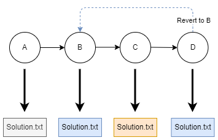

# Git revert

## 1. Introduction

Imagine you are working on a project and you have just committed a change that you want to undo. How do you do that? In this challenge, you will learn how to undo a commit using the `git revert` command.

Remember that a commit is a snapshot of your project at a specific point in time. The commit history is a chain of commits that are linked together. Each commit has a unique identifier called a hash. The hash is a string that looks like this: `a5f4a0d`. You can view your project's commit history by running the `git log` command. By adding the `--oneline` flag to `git log` the output is summarized. Try running the command with and without the flag.

```console
$ git log --oneline
f7f3f6d experiment
310154e updated solution
a5f4a0d add solution
d6016bc first commit
```

When you revert a commit, it is important to note that git creates a new commit that reverts the changes from a previous commit. This ensures that the commit history remains consistent and that you don't lose commit history by simply deleting commits.

<a href="./revert.png" target="_blank">
    
</a>

In the figure above, commit D reverts the changes from commit C, reverting `Solution.txt` to version B.

You can revert a commit by running the following command:

```console
$ git revert <commit-hash> --no-edit
```

The `--no-edit` flag prevents git from opening the default editor to add a commit message by using the message from the commit that is being reverted.

Copy the commit hash you want to revert from the `git log --oneline` output and paste it after the `git revert` command:

```console
$ git revert f7f3f6d --no-edit
```

The above command reverts the code to the version in the "updated solution" commit.

## 2. Challenge

Follow the instructions in the text below to complete the challenge.

1. Create a new file "solution.txt" in the "02-revert" folder with the following content: "This is the solution.".
1. Add, commit and push the file to the remote repository with the message "Correct solution".
1. Change the contents of the file to "This is the wrong solution.".
1. Add, commit and push the file to the remote repository with the message "Wrong solution".
1. Revert the commit with the message "Wrong solution".
1. The revert command outputs 3 lines: the first line is the commit message of the new commit, the second line contains a timestamp and the third line contains info about what has changed. Copy the entire third line and overwrite the contents of the file "solution.txt" with it.
1. Add, commit and push the file.
1. If you have done everything correctly, you will see a "SUCCESS" message from the verify script.
1. If the script fails, you can start over again but you will have to delete the solution file (and commit that change) first.

## 3. General rules

In order to get a "SUCCESS" from the verify script, you will need to make sure that:

-   You have followed the instructions exactly as described in the text. Do not put extra text in files or create extra folders unless asked to do so.
-   Assume that the verify script is case-sensitive. Pay attention to the exact naming of files and folders.
-   Never make changes to the verify script (yes, we will verify all verify scripts afterwards). Changes to the verify script will result in a "FAIL" for the entire challenge.
-   You will only receive a "SUCCESS" if you complete all the steps successfully. If you only complete part of the challenge steps, you will receive a "FAIL" for the entire challenge.
