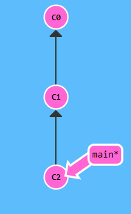

# Git Branching and Merging

## 1. Introduction

We already saw how git allows you to make snapshots of changes to files as commits.

Imagine that you have been working in a git repository for quite a while, as you've made more and more changes, you've also saved them often in commits.

Every commit is like a "save" that you can return to. You already know that the history of your files can be shown as a sequence of commits in order:

In the previous challenge we've seen that you can easily revert one of these commits to undo a whole batch of changes in one go.

In this challenge we'll go further and see how git allows you to play with multiple "lines" of commits at the same time, this is called _branching_.

By default, all your work is performed on the _main_ (or _master_ in older repositories) branch. By adding branches, you can have multiple copies of the same file at the same time with different changes, and easily switch between them.

If you want to combine commits of two branches (and combine all the changes in those commits), you can _merge_ two branches back together.

To learn how branching and merging works and to prepare yourself for this challenge, go to [learngitbranching.js](https://learngitbranching.js.org/) and complete the following levels:

1. Main - Introduction Sequence: Level 1-2-3
1. Main - Ramping Up: Level 1-2-3-4
1. Remote - Push & Pull -- Git Remotes!: Level 1-2-3-4-5-6-7 (level 7 with merge, you do not need to understand rebase)

Every level has a goal that you can reach by typing git commands in the editor. You can always type "undo" to undo your last command.

Return to this challenge after finishing the necessary levels.

## 2. Challenge

To complete this challenge successfully, perform the following steps:

1. Switch to a new git branch called `challenge-3-branch`
1. Create a new empty file in the same folder as these instructions with the name `solution.txt`
1. Write the following text in `solution.txt`: `This text was added in challenge-3-branch`
1. Commit your changes and push `challenge-3-branch` to GitHub
    1. Check via the GitHub UI that everything is pushed
1. Switch to the `main` branch
1. Create a new empty file in the same folder as these instructions with the name `solution.txt`
1. Write the following text in `solution.txt`: `This text was added in main branch`
1. Commit your changes and push your main branch to GitHub
    1. Check via the GitHub UI that everything is pushed
1. Merge `challenge-3-branch` in `main`
1. Resolve the merge conflict, make sure that `solution.txt` contains the line `This text was added in challenge-3-branch` after merging
    1. You can find more information about how to resolve merge conflicts [here](https://docs.github.com/en/pull-requests/collaborating-with-pull-requests/addressing-merge-conflicts/resolving-a-merge-conflict-using-the-command-line)
    1. A merge conflict occurs because the same file had different changes on different branches _at the same time_. When merging the branches back together, git can not know which of the changes should be kept, leading to a conflict between the changes.
1. Commit and push main

We will check your solution using the verify script and by examining your commits on GitHub. Do not remove the `challenge-3-branch` on GitHub!

## 3. General rules

In order to get a "SUCCESS" from the verify script, you will need to make sure that:

-   You have followed the instructions exactly as described in the text. Do not put extra text in files or create extra folders unless asked to do so.
-   Assume that the verify script is case-sensitive. Pay attention to the exact naming of files and folders.
-   Never make changes to the verify script (yes, we will verify all verify scripts afterwards). Changes to the verify script will result in a "FAIL" for the entire challenge.
-   You will only receive a "SUCCESS" if you complete all the steps successfully. If you only complete part of the challenge steps, you will receive a "FAIL" for the entire challenge.

## 4. Extra

[learngitbranching.js](https://learngitbranching.js.org/) is an amazing resource to learn git, since it shows the impact of your commands clearly and visually.

You've now seen the basics of git (committing, pushing, pulling, branching, merging and reverting) but there is much more to learn. Continuing with the levels on the site and learning even more of git (rebasing, cherry-picking, tagging, detaching, ...) is not necessary but is a very powerful asset in your studies and later in your career.

Remember [learngitbranching.js](https://learngitbranching.js.org/) when you want to learn more!