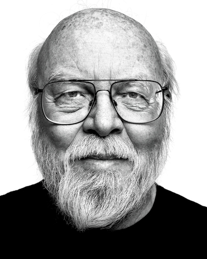

# Reverse image search

# 1. Introduction

Instead of using text-based search queries, you can also use images to find information. This is called "reverse image search". The technology behind reverse image search is based on **Content Based Image Retrieval (CBIR)**. CBIR is a technique that uses the visual content of an image (colour, texture, shape...). This is different from **text-based image retrieval (TBIR)**, which uses metadata such as keywords, tags or descriptions to find images. CBIR is also often used to find similar images to an image.

In the following challenges, you will see a series of images. Create a solution.txt and on every line, write the information that is asked for.

## 2. Challenge

1.  Which programming language did the person in this image create? (1 word)

    

1.  Which programming language did the person in this image create? (1 word)

    

1.  This person is famous for creating the kernel of a popular operating system. While developing that kernel, he also created a version management system that is widely used today. What is the name of that version management system? (1 word)?

    

1.  This person also invented a programming language. The name of that programming language is also the brand of a non-IT product that is a necessity for many programmers to write clean code. What is the name of that product (not the brand)? (1 word, in English)

    

1.  This person is widely respected as one of the founders of the free (and open source) software movement. He is also the creator of a popular program in the Unix world. Together with this program there is another popular alternative that serves the same purpose and with which there was years of rivalry between the users. The name of that alternative program consists of two letters. Which two letters?

    

## 3. General rules

In order to get a "SUCCESS" from the verify script, you will need to make sure that:

-   You have followed the instructions exactly as described in the text. Do not put extra text in files or create extra folders unless asked to do so.
-   Assume that the verify script is case-sensitive. Pay attention to the exact naming of files and folders.
-   Never make changes to the verify script (yes, we will verify all verify scripts afterwards). Changes to the verify script will result in a "FAIL" for the entire challenge.
-   You will only receive a "SUCCESS" if you complete all the steps successfully. If you only complete part of the challenge steps, you will receive a "FAIL" for the entire challenge.
